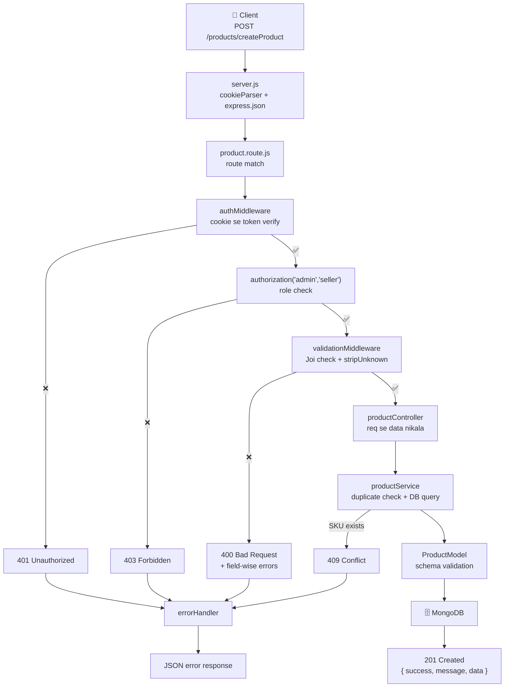
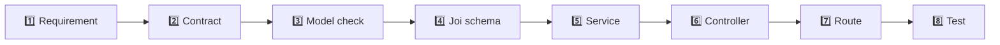
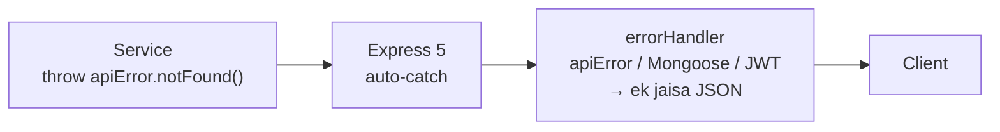

# 🛒 Products API — Node.js + Express 5 + MongoDB

Class demo project. **MVC + Service Layer** pattern.
Har file me Hinglish comments hain, aur har decision ka **"aisa kyun kiya"** likha hua hai.

> 📖 **Line-by-line code explanation → [`docs/CODE-EXPLAINED-HINGLISH.md`](docs/CODE-EXPLAINED-HINGLISH.md)**

---

## 📑 Table of Contents

1. [Ye Repo Kaise Padhein (students ke liye)](#-ye-repo-kaise-padhein-students-ke-liye)
2. [Tech Stack — kaunsi library kya karti hai](#-tech-stack--kaunsi-library-kya-karti-hai)
3. [Quick Start](#-quick-start)
4. [Folder Structure](#-folder-structure)
5. [Product Schema](#-product-schema-5-fields)
6. [Architecture — Request ka Safar](#-architecture--request-ka-safar)
7. [API Endpoints](#-api-endpoints)
8. [Search API — Deep Dive](#-search-api--deep-dive)
9. [Thought Process — Nayi API Kaise Banate Hain](#-thought-process--nayi-api-kaise-banate-hain)
10. [Har API ka Apna Thought Process](#-har-api-ka-apna-thought-process)
11. [Error Handling Strategy](#-error-handling-strategy)
12. [HTTP Status Codes — Kab Kaunsa](#-http-status-codes--kab-kaunsa)
13. [Code Maintenance Rules](#-code-maintenance-rules)
14. [Security Checklist](#-security-checklist)
15. [Postman Setup](#-postman-setup)
16. [Practice Assignment](#-practice-assignment)
17. [Kya-Kya Change Hua](#-kya-kya-change-hua)

---

## 🎓 Ye Repo Kaise Padhein (students ke liye)

Code ko **is order me** padhna — random file khologe to confusion hoga:

```
1. src/model/productModel.js          →  "Data dikhta kaisa hai?"        (5 min)
2. src/routes/product.route.js        →  "Kaunsa URL kahan jaata hai?"   (10 min)
3. src/validationSchema/...           →  "Input check kaise hota hai?"   (10 min)
4. src/controller/productController.js→  "Request se response tak"       (10 min)
5. src/service/productService.js      →  "Asli kaam yahan hota hai" 🧠   (20 min)
6. src/middlewares/errorHandler.js    →  "Error kahan jaata hai?"        (10 min)
```

Phir `docs/CODE-EXPLAINED-HINGLISH.md` kholo — wahan har line ka matlab likha hai.

**Ek baat pakki samajh lo, poora architecture isi pe khada hai:**

> **Data neeche jaata hai. Error upar aata hai.**
> Route → Controller → Service → Model → MongoDB
> Har layer sirf **apne neeche wali** layer ko jaanti hai.
> Service ko `req` ka pata nahi. Model ko HTTP ka pata nahi.

---

## 🧰 Tech Stack — kaunsi library kya karti hai

| Library | Kaam | Kyun zaroori hai |
|---|---|---|
| **express** `^5.2.1` | Web server + routing | Bina iske raw Node me har URL manually handle karna padta |
| **mongoose** `^9.8.1` | MongoDB ODM | Schema, validation, hooks — raw MongoDB driver me ye kuch nahi milta |
| **joi** `^18.2.3` | Request validation | DB tak pahunchne se **pehle** ganda data rok deta hai |
| **jsonwebtoken** | Token banana + verify | Stateless login — server ko session yaad rakhne ki zaroorat nahi |
| **bcrypt** | Password hashing | Plain password DB me kabhi nahi. Hash **one-way** hota hai |
| **cookie-parser** | Cookie string → `req.cookies` | Hum token cookie me bhejte hain, header me nahi |
| **dotenv** | `.env` file load | Secrets code me hardcode nahi karte |
| **nodemon** *(dev)* | Auto restart | File save karte hi server restart — manual `Ctrl+C` nahi |

### Express 5 ki 2 nayi baatein (jo Express 4 se alag hain) ⭐

Aap Express **5** use kar rahe ho, isliye ye 2 cheezein alag behave karti hain:

**1. Async errors apne aap handle ho jaate hain**
```js
// Express 5 — try/catch ki zaroorat NAHI
const getProduct = async (req, res) => {
  const p = await productService.getProductById(req.params.id);  // throw kare to?
  res.json(p);                                                    // apne aap errorHandler me
};

// Express 4 me ye wrapper likhna padta tha
const catchAsync = (fn) => (req, res, next) => {
  Promise.resolve(fn(req, res, next)).catch(next);
};
```

**2. `req.query` ab sirf GETTER hai**
```js
req.query = cleanedValue;                              // ❌ CRASH in Express 5
Object.defineProperty(req, "query", { value, ... });   // ✅ Express 4 + 5 dono me chalega
```
Isi wajah se `validationMiddleware.js` me `Object.defineProperty` use kiya hai.

---

## 🚀 Quick Start

```bash
npm install

# .env banao (ye file GitHub pe NAHI jaayegi — .gitignore me hai)
cp .env.example .env
# phir .env kholo:
#   db_URL=mongodb://127.0.0.1:27017/techno_c6
#   secret_key=koi_lamba_random_string

npm run dev        # nodemon se auto-restart
```

Server chalega: `http://localhost:3000`

**Secret key generate karne ka tarika:**
```bash
node -e "console.log(require('crypto').randomBytes(32).toString('hex'))"
```

---

## 📁 Folder Structure

```
server.js                          # Entry point — middlewares, routes, error handler, DB connect
src/
├── config/
│   └── db.js                      # MongoDB connection
│
├── model/                         # 🗄️  DATA ka shape
│   ├── productModel.js            # Product schema  (⚠️ isme kuch change nahi kiya)
│   ├── authModel.js
│   ├── addressModel.js
│   └── index.js
│
├── validationSchema/              # 🛡️  INPUT ka guard
│   └── productValidationSchema.js # Joi schemas (body / query / params)
│
├── service/                       # 🧠 BUSINESS LOGIC + DB queries
│   └── productService.js
│
├── controller/                    # 🗣️  TRANSLATOR (HTTP ↔ service)
│   └── productController.js
│
├── routes/                        # 🚦 TRAFFIC POLICE
│   └── product.route.js
│
├── middlewares/                   # 🔁 Har request pe chalne wala code
│   ├── authValidation.js          # token verify → req.user       (fail → 401)
│   ├── authorization.js           # role check                    (fail → 403)
│   ├── validationMiddleware.js    # Joi apply — body/query/params (fail → 400)
│   └── errorHandler.js            # notFound + global error handler
│
└── utils/                         # 🔧 Chhote reusable tools
    ├── apiError.js                # statusCode wale error banane ke functions
    ├── httpStatus.js              # status code constants
    └── helpers.js                 # escapeRegex, buildSort, pagination
```

### Har folder ka ek line me kaam

| Folder | Sawaal jiska jawab deta hai |
|---|---|
| `routes/` | **"Kaunsa URL?"** |
| `middlewares/` | **"Andar aane doon ya nahi?"** |
| `validationSchema/` | **"Data sahi hai kya?"** |
| `controller/` | **"Kya call karna hai, kya wapas bhejna hai?"** |
| `service/` | **"Asli kaam kaise hoga?"** 🧠 |
| `model/` | **"Data dikhta kaisa hai?"** |

### Restaurant se compare karo 🍽️

| Restaurant | Code |
|---|---|
| 🚪 Bouncer (ID check) | `authMiddleware` |
| 🎫 VIP list | `authorization("admin")` |
| 📋 Menu check | `validationMiddleware` |
| 🧑‍💼 Waiter | `productController` |
| 👨‍🍳 **Chef** | `productService` 🧠 |
| 📜 Recipe | `productModel` |
| 🏪 Godown | MongoDB |
| 🏥 First-aid room | `errorHandler` |

**Waiter khana nahi banata. Chef table pe serve nahi karta.** Yahi MVC + Service hai.

---

## 🗄️ Product Schema (5 fields)

```js
{
  name:        String,   // 2-64 chars, required, trim
  SKU:         String,   // unique, required, trim
  price:       Number,   // min 0, required
  description: String,   // max 264 chars, trim
  category:    String,   // enum: Electronics | Clothing | Books | Home | Sports
}
```

### 3 baatein jo is schema se nikalti hain

**1. `unique: true` sirf validation nahi, ek INDEX hai**
Isliye SKU se search **fast** hai. Aur duplicate aane pe MongoDB error code `11000`
deta hai — `errorHandler` usko **409 Conflict** me badal deta hai.

**2. `timestamps: true` nahi hai** → `createdAt` field **hai hi nahi**
Matlab `sort({ createdAt: -1 })` kaam nahi karega.
**Jugaad:** MongoDB ke `_id` (ObjectId) ke andar creation timestamp chhupa hota hai!
Isliye default sort `{ _id: -1 }` rakha = "naya product pehle". 👌

**3. Koi `seller` field nahi hai** → product kiska hai ye track nahi hota
Isliye "apna hi product edit kar sakte ho" wala check nahi laga sakte — sirf **role**
check hai. (Ye limitation README ke last me discuss ki hai.)

---

## 🔄 Architecture — Request ka Safar



### Text version (yaad rakhne ke liye)

```
CLIENT
  ▼
server.js ──── cookieParser, express.json
  ▼
routes ──────── URL match + middleware chain
  │
  ├─► authMiddleware  → "Kaun ho tum?"     fail → 401
  ├─► authorization   → "Allowed ho?"      fail → 403
  ├─► validation      → "Data sahi hai?"   fail → 400
  ▼
controller ──── req se data nikala, service ko diya
  ▼
service ─────── business logic + DB query      fail → throw apiError.notFound()
  ▼
model ───────── schema validation
  ▼
MongoDB
  ▼ (wapas ulta safar)
controller ──── res.status(201).json({...})
  ▼
CLIENT
```

> 💡 `next()` = "agla middleware chalao"
> `next(err)` = "sab skip karo, seedha error handler pe jao"
> `throw` (async function me, Express 5) = same as `next(err)`

---

## 📡 API Endpoints

Base URL: `http://localhost:3000/products`
Auth: **cookie** me `token` (login karne pe apne aap set ho jaata hai)

| # | Method | Endpoint | Roles | Kaam |
|---|---|---|---|---|
| 1 | `POST` | `/createProduct` | admin, seller | Naya product |
| 2 | `GET` | `/getAllProducts` | admin, seller, user | List + filter + pagination |
| 3 | `GET` | `/searchProducts?q=` | admin, seller, user | 🔍 **Search (naya)** |
| 4 | `GET` | `/getSingleProduct/:id` | admin, seller, user | Ek product |
| 5 | `PATCH` | `/updateSingleProduct/:id` | admin, seller | Update |
| 6 | `DELETE` | `/deleteProduct/:id` | admin | Delete |

### Success response ka standard shape

```json
{
  "success": true,
  "message": "Products fetched successfully",
  "data": [ /* ... */ ],
  "meta": {
    "page": 1, "limit": 10, "totalResults": 48, "totalPages": 5,
    "hasNextPage": true, "hasPrevPage": false
  }
}
```

**Ye shape sab APIs me SAME rakha hai.** Kyun? Frontend wale ko har API me alag
structure milega to wo pagal ho jaayega. Ek fix contract = ek hi baar code likhna padta hai.

### Error response ka standard shape

```json
{
  "success": false,
  "message": "Validation failed",
  "errors": [
    { "field": "price", "message": "price must be a number" },
    { "field": "category", "message": "category must be one of: Electronics, Clothing, Books, Home, Sports" }
  ]
}
```

### Sample requests

<details>
<summary><b>1. Create Product</b></summary>

```http
POST /products/createProduct
Content-Type: application/json
Cookie: token=<jwt>

{
  "name": "Dell Laptop",
  "SKU": "DL-XPS-15",
  "price": 155000,
  "description": "15 inch creator laptop",
  "category": "Electronics"
}
```
→ **201 Created**   |   duplicate SKU → **409 Conflict**
</details>

<details>
<summary><b>2. Get All Products</b></summary>

```http
GET /products/getAllProducts?category=Electronics&minPrice=10000&maxPrice=200000&sortBy=price:asc&page=1&limit=10
```
→ **200 OK**
</details>

<details>
<summary><b>3. Search Products</b></summary>

```http
GET /products/searchProducts?q=laptop
GET /products/searchProducts?q=lap&category=Electronics&sortBy=price:desc
GET /products/searchProducts?q=DL-XPS
```
→ **200 OK** (0 result bhi 200 hai)
</details>

<details>
<summary><b>4. Update / Delete</b></summary>

```http
PATCH  /products/updateSingleProduct/:id     { "price": 149000 }
DELETE /products/deleteProduct/:id
```
</details>

---

## 🔍 Search API — Deep Dive

```
GET /products/searchProducts?q=laptop&category=Electronics&minPrice=1000&maxPrice=99999&sortBy=price:asc&page=1&limit=10
```

| Param | Zaroori? | Kaam |
|---|---|---|
| `q` | ✅ | Keyword (1-80 chars) |
| `category` | ❌ | Enum me se ek |
| `minPrice` / `maxPrice` | ❌ | Price range |
| `sortBy` | ❌ | `name` / `price` / `category` + `:asc` / `:desc` |
| `page` / `limit` | ❌ | Default 1 / 10, limit max 100 |

### Kaise kaam karta hai

```js
const searchRegex = new RegExp(escapeRegex(q), "i");   // i = case-insensitive

filter = {
  ...categoryAndPriceFilters,
  $or: [
    { name: searchRegex },
    { description: searchRegex },
    { category: searchRegex },
    { SKU: searchRegex },
  ],
};
```

`$or` = in me se **kisi ek** field me match ho gaya to product aa jaayega.
**Sirf aapke 5 schema fields** use kiye hain — koi naya field add nahi kiya.

### Regex vs Text Index — kyun regex chuna?

| | Regex (jo use kiya) | `$text` index |
|---|---|---|
| Partial match (`"lap"` → `"Laptop"`) | ✅ | ❌ poora word chahiye |
| Speed (bade data pe) | 🐢 slow | ⚡ bahut fast |
| Schema change chahiye? | ❌ nahi | ✅ ek index line add karni padti |

Schema me kuch change nahi karna tha, isliye **regex**. Partial match ka fayda bhi mila.

> 💡 **Agar aage speed chahiye** (10,000+ products), model me ye ek line add karni hogi —
> **fields nahi badlenge**, sirf index banega:
> ```js
> productSchema.index({ name: "text", description: "text" });
> ```
> Phir service me `$text: { $search: q }` use kar sakte ho.

### 🔐 ReDoS — search ka sabse bada security bug

```js
const rx = new RegExp(req.query.q, "i");                // ❌ GALAT
const rx = new RegExp(escapeRegex(req.query.q), "i");   // ✅ SAHI
```

User `?q=(a+)+$` bhej de to regex engine **exponential time** lene lagta hai.
Node **single-threaded** hai — ek hi request **poore server ko freeze** kar degi.
Baaki saare users ke liye app down. Ye real production outage ka reason ban chuka hai.

---

## 🧠 Thought Process — Nayi API Kaise Banate Hain

Har baar **yahi 8 steps**. Koi bhi API ho — order, cart, payment.



### Step 1 — Requirement English me likho (code se pehle)

> "User ko products search karne dena hai. Keyword se naam, description, category
> aur SKU me dhoondhe. Category aur price filter bhi chale. Result paginated ho."

**Agar ye ek line me nahi likh paa rahe, to code likhne ke liye ready nahi ho.**

### Step 2 — API Contract design karo

Ye **6 sawaal** ka jawab likho:

| Sawaal | Search API ka jawab |
|---|---|
| **Method?** | `GET` (data padh rahe hain, badal nahi rahe) |
| **URL?** | `/products/searchProducts` |
| **Input kahan?** | Query params — `?q=&category=&minPrice=&page=&limit=` |
| **Kaun call kar sakta hai?** | admin, seller, user (teeno) |
| **Success me kya?** | `200` + array + pagination meta |
| **Kya-kya fail ho sakta hai?** | `q` missing → 400, `limit=99999` → 400, token nahi → 401 |

> 💡 **Sabse important habit:** *"Kya-kya GALAT ho sakta hai"* pehle sochna.
> Junior developer **happy path** sochta hai. Senior developer **failure path** sochta hai.

### Step 3 — Model check karo

Sawaal: *"Jo data chahiye wo schema me hai? Query fast chalegi ya poori collection padhegi?"*

Humare case me: 5 fields kaafi the. Sort ke liye `createdAt` chahiye tha — **nahi mila** →
`_id: -1` se kaam chalaya.

> **Index ka rule:** jis field pe `find` / `sort` / `filter` karte ho, us pe index hona
> chahiye. Bina index ke MongoDB **poori collection** padhta hai (COLLSCAN) —
> 10 lakh documents pe app mar jaayegi.
> Humare schema me sirf `SKU` pe index hai (`unique: true` se apne aap ban gaya).

### Step 4 — Joi validation likho

Yahan **sirf input ki shakal** sochni hai, business logic nahi.

**Checklist:**
- [ ] Har field ka type set hai?
- [ ] `required` vs optional clear hai?
- [ ] Numbers pe `min`/`max` hai? (specially `limit` — `.max(100)`)
- [ ] Strings pe `max` length hai?
- [ ] Rules **model se match** karte hain? (price `min(0)`, description `max(264)`)
- [ ] Enum values **model se copy** ki hain?

### Step 5 — Service likho (yahan sabse zyada sochna hai)

```
1. Input se DB filter banao
2. Business rule check karo (duplicate SKU, product exist)
3. Query chalao
4. Result return karo — HTTP ka naam mat lo
```

**Service me `req`/`res` likhne ka man kare → ruk jao.** Jo chahiye wo parameter me lo.

### Step 6 — Controller likho (3-4 line, bas)

```js
const searchProducts = async (req, res) => {
  const { products, meta } = await productService.searchProducts(req.query);
  res.status(httpStatus.OK).json({ success: true, message, data: products, meta });
};
```

### Step 7 — Route wire karo

```js
productRouter.get("/searchProducts",
  authMiddleware,                                        // kaun ho?
  authorization("admin", "seller", "user"),              // allowed ho?
  validationMiddleware(searchProductSchema, "query"),    // data sahi hai?
  productController.searchProducts);                     // ab kaam karo
```

### Step 8 — Test karo — sirf happy path nahi

| Test | Expected |
|---|---|
| `?q=laptop` | 200 + results |
| `?q=zzzzz` | 200 + **empty array** (404 nahi!) |
| `?q=` (khaali) | 400 |
| `q` bheja hi nahi | 400 |
| `?limit=99999` | 400 |
| `?minPrice=500&maxPrice=100` | 400 |
| `?q=(a+)+$` | 200, server hang **nahi** hona chahiye |
| Bina token | 401 |
| `user` role se createProduct | 403 |
| Duplicate SKU | 409 |

---

## 🎯 Har API ka Apna Thought Process

Upar wale 8 steps **har API** pe kaise apply hue — ek-ek karke.

---

### 1️⃣ CREATE PRODUCT — `POST /createProduct`

**Requirement:** Seller ya admin apna naya product add kar sake.

| Sawaal | Jawab |
|---|---|
| Method | `POST` — **naya data ban raha hai** |
| Input | `body` |
| Access | admin, seller *(normal user product nahi bech sakta)* |
| Success | `201 Created` + naya product |

**Sochne wali baatein:**

- **SKU unique hai** → duplicate check karna padega. Pehle `findOne({ SKU })` kiya
  taaki user ko **saaf message** mile.
- ⚠️ **Par ye check 100% pakka nahi hai!** Do requests bilkul ek saath aa jaayein to
  dono ka `findOne` `null` dega aur dono create karne chalengi — ye **RACE CONDITION** hai.
  Bachaata kaun hai? Model ka `unique: true` **index** — wo `11000` error dega jise
  `errorHandler` **409** me badal deta hai.
  **Matlab:** `findOne` check = achhe **message** ke liye, `unique` index = asli **safety**.
- **201 bhejna hai, 200 nahi** — nayi resource bani hai.

**Fail cases:** `400` validation · `401` token nahi · `403` role galat · `409` duplicate SKU

---

### 2️⃣ GET ALL PRODUCTS — `GET /getAllProducts`

**Requirement:** Products ki list, filter aur page ke saath.

| Sawaal | Jawab |
|---|---|
| Method | `GET` |
| Input | `query` — category, minPrice, maxPrice, sortBy, page, limit |
| Access | admin, seller, user (teeno) |
| Success | `200` + array + pagination meta |

**Sochne wali baatein:**

- **`limit` pe `max(100)` ZAROORI hai** — bina iske `?limit=99999999` se poora DB
  ek request me kheech liya jaayega → memory bhar → **crash**. Ye asli DoS vector hai.
- **`Promise.all` use kiya** — `find()` aur `countDocuments()` **parallel** chalti hain:
  sequential 70ms → parallel 40ms. Muft ki speed.
- **`.lean()` lagaya** — Mongoose document ki jagah plain object, 2-3x fast.
  *(Rule: sirf padhna hai → `.lean()`. Modify karke save karna hai → mat lagao.)*
- **`.select("-SKU")`** — SKU internal identifier hai, listing me client ko nahi bhejte.
- **Default sort `{ _id: -1 }`** — kyunki schema me `timestamps` nahi hai.

**Fail cases:** `400` galat query · `401` token nahi

---

### 3️⃣ SEARCH PRODUCTS — `GET /searchProducts` ⭐

**Requirement:** Keyword se product dhoondhna, filter ke saath.

| Sawaal | Jawab |
|---|---|
| Method | `GET` |
| Input | `query` — `q` (required) + wahi filters |
| Access | admin, seller, user |
| Success | `200` + array (**0 result bhi 200**) |

**Sochne wali baatein:**

- **Text index vs regex?** Text index fast hai par schema me index line add karni padti,
  aur partial match nahi karta. Schema chhedna nahi tha → **regex** chuna.
- **`escapeRegex()` lagana MANDATORY hai** — ReDoS se bachne ke liye. Ye optional nahi hai.
- **`$or` me 4 fields** — name, description, category, SKU. Sirf schema wale fields.
- **`maxTimeMS(5000)`** — 5s se lambi query MongoDB khud maar dega.
- **0 result = `200`, `404` nahi** — query successfully chali, bas match nahi mila.
  Ye ek **valid answer** hai, error nahi.

**Fail cases:** `400` `q` missing/khaali · `400` limit bada · `401` token nahi

---

### 4️⃣ GET SINGLE PRODUCT — `GET /getSingleProduct/:id`

**Requirement:** Ek product ki poori detail.

| Sawaal | Jawab |
|---|---|
| Method | `GET` |
| Input | `params` — `:id` |
| Access | teeno roles |
| Success | `200` + product |

**Sochne wali baatein:**

- **ObjectId format Joi se check kiya** — 24 character hex. Isse galat ID pe
  **DB call jaayegi hi nahi** (`CastError` se pehle hi rok diya).
- **"Not found" ka faisla SERVICE me hai**, controller me nahi:
  ```js
  if (!product) throw apiError.notFound("Product");
  ```
  Isse har controller me `if (!product) return res.status(404)...` likhna nahi padta.
- Yahan `.select("-SKU")` **nahi** lagaya — single product me poori detail chahiye hoti hai.

**Fail cases:** `400` galat ObjectId · `401` · `404` product nahi mila

---

### 5️⃣ UPDATE PRODUCT — `PATCH /updateSingleProduct/:id`

**Requirement:** Product ki kuch fields badalna.

| Sawaal | Jawab |
|---|---|
| Method | `PATCH` — **partial** update |
| Input | `params` + `body` (dono validate) |
| Access | admin, seller |
| Success | `200` + updated product |

**Sochne wali baatein:**

- **PATCH vs PUT:**
  `PATCH` = jo bheja **sirf wahi** badlega
  `PUT` = **poora replace** — jo field nahi bheji wo **UD JAAYEGI**
  `{ price: 100 }` PUT se bhejoge to name, SKU, category **gayab**! → 99% cases me PATCH sahi.
- **`.min(1)` body pe** — khaali `{}` allowed nahi, warna bekaar DB write hoti rahegi.
- **SKU badla ja raha hai?** to check karo wo kisi **aur** product ka to nahi:
  ```js
  findOne({ SKU: newSKU, _id: { $ne: id } })   // $ne = khud ko chhod ke
  ```
  Iske bina product **apne hi SKU** se "duplicate" ban jaata. 😅
- **`.save()` use kiya, `findByIdAndUpdate` nahi** — kyunki `.save()` se poori schema
  validation chalti hai. `findByIdAndUpdate` me validators **skip** ho jaate hain
  (`runValidators: true` dena padta hai) aur save hooks fir bhi nahi chalte.

**Fail cases:** `400` · `401` · `403` · `404` · `409` naya SKU already exists

---

### 6️⃣ DELETE PRODUCT — `DELETE /deleteProduct/:id`

**Requirement:** Product hatana.

| Sawaal | Jawab |
|---|---|
| Method | `DELETE` |
| Input | `params` |
| Access | **sirf admin** — delete sabse khatarnak operation hai |
| Success | `200` + confirmation |

**Sochne wali baatein:**

- **`findByIdAndDelete` `null` deta hai** agar product mila hi nahi — isse pata chal
  jaata hai ki delete hua ya nahi. Alag se `findById` karne ki zaroorat nahi (1 DB call bachi).
- **Response me deleted product bhejne ka matlab nahi** — wo ab exist hi nahi karta.
  `data: null` bhej rahe hain taaki shape sab jagah same rahe.
- ⚠️ **Ye HARD DELETE hai** — data hamesha ke liye gaya. Real apps me **SOFT DELETE**
  karte hain (`isDeleted: true` flag) taaki **order history, invoice, analytics** na tootein.
  Uske liye schema me ek field chahiye — abhi schema chhed nahi rahe, isliye hard delete.
  *(Ye assignment me diya hua hai — neeche dekho.)*

**Fail cases:** `400` galat ObjectId · `401` · `403` seller ne try kiya · `404`

---

## 🚨 Error Handling Strategy

### Principle: **Error ko `throw` karo, handle EK jagah karo**



### ❌ Galat tarika (jo pehle tha)

```js
const createProduct = async (req, res) => {
  try {
    ...
  } catch (err) {
    console.log("error", err);      // ⬅ client ko KUCH NAHI gaya!
  }
};
```
**Problem:** error sirf terminal me print hota tha. Client ka request **hamesha ke liye
latak jaata** — browser timeout hota. Aur har controller me yahi 6 line repeat.

### ✅ Sahi tarika

```js
// service — error THROW karo
if (!product) throw apiError.notFound("Product");

// controller — try/catch nahi (Express 5)
const getSingleProduct = async (req, res) => {
  const product = await productService.getProductById(req.params.id);
  res.status(httpStatus.OK).json({ success: true, message: "...", data: product });
};
```

### `errorHandler` kya-kya sambhalta hai

| Error | Ban jaata hai |
|---|---|
| `apiError` se bana error (humara) | Jo statusCode diya |
| `CastError` (galat ObjectId) | 400 |
| `ValidationError` (Mongoose) | 400 + field-wise |
| `code: 11000` (duplicate SKU) | **409** |
| `JsonWebTokenError` | 401 |
| `TokenExpiredError` | 401 "Token expired, please login again" |
| `SyntaxError` (galat JSON) | 400 |
| Baaki sab | 500 |

### ⚠️ 4 galtiyan jo har student karta hai

```js
// 1. Error middleware me 4 parameters nahi diye
app.use((err, req, res) => {});           // ❌ Express isko normal middleware samjhega
app.use((err, req, res, next) => {});     // ✅ 4 params ZAROORI (next use na ho tab bhi)

// 2. Error handler routes se PEHLE laga diya
app.use(errorHandler);
app.use("/products", productRouter);      // ❌ error handler kabhi chalega hi nahi

// 3. Middleware me return nahi kiya
if (!allowed) { res.status(403).send("no"); }
next();                                   // ❌ ye FIR BHI chalega!

// 4. Response bhejne ke baad next()
res.json(data);
next();                                   // ❌ "Cannot set headers after they are sent"
```

### Production me stack trace kabhi mat bhejo

```js
...(process.env.NODE_ENV === "production" ? {} : { stack: err.stack })
```
Stack trace me file paths, package versions, kabhi DB structure tak leak hota hai —
attacker ke liye ye **free reconnaissance** hai.

---

## 📊 HTTP Status Codes — Kab Kaunsa

### Quick rule

```
2xx  →  Sab theek
4xx  →  Client ne galti ki   (usko fix karna hai)
5xx  →  Server ne galti ki   (humein fix karna hai)
```

### Is project me use hone wale codes

| Code | Naam | Kab | Is project me kahan |
|---|---|---|---|
| **200** | OK | GET / PATCH / DELETE safal | List, search, get, update, delete |
| **201** | Created | POST se nayi resource bani | createProduct |
| **400** | Bad Request | Input galat/missing | Joi fail, invalid ObjectId |
| **401** | Unauthorized | Token nahi / invalid / expired | `authMiddleware` fail |
| **403** | Forbidden | Token sahi, **permission nahi** | `authorization` fail |
| **404** | Not Found | Resource exist nahi karta | Product nahi mila, unknown route |
| **409** | Conflict | Duplicate | **SKU already exists** |
| **500** | Internal Server Error | Humara code phata | Unexpected exception |

### 401 vs 403 — sabse common confusion

```
401 Unauthorized  =  "Tum kaun ho? Pehle ID card dikhao."             → login karo, kaam ban jaayega
403 Forbidden     =  "ID card sahi hai, par tum andar nahi aa sakte."  → login se KUCH NAHI hoga
```

Yaad rakhne ka tarika: **401 = Authentication fail, 403 = Authorization fail.**

> 🔴 Purane `authorization.js` me **401** tha — usko **403** kiya hai.
> 401 ki wajah se frontend user ko galti se **logout** kar deta tha.

### 409 kab? (SKU wala case)

```
POST /createProduct  { "SKU": "DL-XPS-15" }   ← ye SKU pehle se hai
```
Request bilkul **sahi** thi (400 nahi), server bhi theek hai (500 nahi) —
bas **resource pehle se mojood hai** → **409 Conflict**.

### ⚠️ Search me 0 results = **200, NOT 404**

```
GET /products/searchProducts?q=zzzzz
→ 200 OK  { "success": true, "data": [], "message": "No products found for \"zzzzz\"" }
```

**Kyun?** Query successfully chali. "Kuch nahi mila" ek **valid answer** hai, error nahi.
404 tab do jab **resource ka URL hi exist nahi karta** — jaise
`/getSingleProduct/<aisi id jo hai hi nahi>`.

### ⚠️ Har cheez pe 200 mat bhejna

```js
res.status(200).json({ success: false, message: "Product not found" });   // ❌
```
Frontend ka `axios` isko **success** samjhega, `.catch()` chalega hi nahi.
**Status code hi asli signal hai** — body me `success: false` likhne se kuch nahi hota.

---

## 🧹 Code Maintenance Rules

### 1. Layer ki maryada mat todo

| Layer | Ye kar sakta hai | Ye **NAHI** kar sakta |
|---|---|---|
| **Route** | middleware chain jodna | logic likhna, DB touch karna |
| **Controller** | `req` se data lena, response bhejna | `ProductModel.find()`, business rules |
| **Service** | DB query, business logic | `req`, `res`, `res.status()` |
| **Model** | schema, hooks, indexes | HTTP ka koi zikr |

**Quick self-test:**
- Controller me `ProductModel.` dikha? → service me le jao
- Service me `req.` dikha? → parameter bana ke pass karo
- Route file me `await Model.` dikha? → service me le jao
- Route file 100 line se badi? → naye router me todo

### 2. Naming convention fix rakho

```
Files:      productModel.js  productService.js  productController.js
            product.route.js  productValidationSchema.js

Functions:  createProduct  getAllProducts  getProductById  updateProduct
            (verb + Noun, camelCase)

Constants:  CATEGORIES  SORTABLE_FIELDS  LIST_FIELDS     (UPPER_SNAKE_CASE)
Private fn: _buildFilter                                  (underscore prefix)
Variables:  hasNextPage  productExist                     (boolean = is/has se shuru)
```

Comment tabhi likho jab **"kyun"** batana ho — **"kya"** to code khud bata raha hai.

```js
// ❌ Bekaar comment
// price ko filter me daalo
filter.price = { $gte: minPrice };

// ✅ Kaam ka comment
// !== undefined isliye kyunki 0 bhi falsy hai — minPrice=0 valid filter hai
if (minPrice !== undefined) filter.price.$gte = minPrice;
```

### 3. Nayi feature aaye to kya karna

Har naye module (order, cart) ke liye **wahi 5 files** banao:

```
src/model/orderModel.js
src/validationSchema/orderValidationSchema.js
src/service/orderService.js
src/controller/orderController.js
src/routes/order.route.js
```
Phir `server.js` me ek line: `app.use("/orders", orderRouter);`

**Kab folder structure badlo?** Jab 5+ modules ho jaayein aur ek feature ke liye
5 alag folder me file dhoondhni pade → tab **feature-based** structure me shift karo:

```
Aaj (layer-based):          Kal (feature-based):
src/                         src/modules/
├── model/                   ├── product/
├── service/                 │   ├── productModel.js
├── controller/              │   ├── productService.js
└── routes/                  │   ├── productController.js
                             │   ├── product.route.js
                             │   └── productValidation.js
                             └── order/
```

### 4. Har naye API ke saath ye 3 cheezein UPDATE karo

1. **README ka endpoint table** — warna 6 mahine baad koi nahi jaanta API hai bhi ya nahi
2. **Postman collection** — naya request add karo (positive + negative dono)
3. **Validation schema** — bina Joi schema ke API **kabhi merge mat karo**

### 5. DRY — par bina paagalpan ke

- **2 baar** same code dikha → chalne do
- **3 baar** dikha → helper bana do

`escapeRegex`, `buildSort`, `_buildFilter`, `CATEGORIES` isi rule se bane hain.

### 6. Magic values ko naam do

```js
// ❌
if (user.role === "admin") { ... }
.select("-SKU")

// ✅
const ROLES = { ADMIN: "admin", SELLER: "seller", USER: "user" };
const LIST_FIELDS = "-SKU";
```

### 7. Joi aur Mongoose ke rules HAMESHA same rakho

Ye purane code ki asli problem thi:

| Field | Joi kehta tha | Model kehta tha | Result |
|---|---|---|---|
| `price` | `min(1)` | `min: 0` | Free product add nahi hota tha |
| `description` | `max(256)` | `maxLength: 264` | 260 char Joi se nikalta, Mongoose pe fail |
| `category` | koi bhi string | `enum: [5 values]` | Ganda Mongoose error user ko dikhta |

**Rule:** enum values Joi me **model se copy** karo, aur limits **exactly same** rakho.

### 8. Git hygiene

```bash
# Branch naming
feat/product-search
fix/authorization-missing-return
refactor/product-service
docs/readme-update

# Commit message (Conventional Commits)
feat(product): add search API with regex + filters
fix(auth): add missing return in authorization middleware
refactor(product): move DB logic from route to service
docs(readme): add status code table
```

**Kabhi commit mat karo:** `.env`, `node_modules/`, `console.log()` debugging,
commented-out purana code (Git hi history hai — code me laash mat rakho).

> ⚠️ **GitHub pe push karne se pehle:** `.env` `.gitignore` me hai ✅, lekin agar
> pehle kabhi commit ho chuka hai to history me abhi bhi mojood hoga. Check karo:
> ```bash
> git log --all --full-history -- .env
> ```
> Agar dikhe to: `git rm --cached .env` + `secret_key` aur DB password **badal do**.

### 9. Refactor karne ka signal

| Dikha? | Karo |
|---|---|
| Function 40+ line ka | Chhote functions me todo |
| 3+ nested `if` | Early return (guard clause) use karo |
| Same query 3 jagah | Service method banao |
| File 300+ line | Split karo |
| Function ke naam me "And" (`createAndNotify`) | 2 functions banao |
| Route file me `await Model.` | Service me le jao |

---

## 🔐 Security Checklist

Har PR merge karne se pehle:

- [ ] **Middleware me `return`** — response ke baad `next()` to nahi chal raha?
- [ ] **Pagination limit** — `limit` pe `max()` laga hai? (bina iske DoS)
- [ ] **Regex escape** — user input seedha `new RegExp()` me to nahi ja raha? (ReDoS)
- [ ] **stripUnknown** — extra fields strip ho rahe hain? (mass assignment)
- [ ] **401 vs 403** — sahi code ja raha hai?
- [ ] **Password leak** — `authModel` me password `select: false` hona chahiye ⚠️
- [ ] **Error leak** — production me `stack` trace nahi ja raha?
- [ ] **`.env` gitignored** — aur git history me bhi nahi hai?
- [ ] **Auth pehle, validation baad me** — schema leak na ho

### Auth pehle kyun, validation baad me?

```js
// PURANA
productRouter.post('/createProduct',
  validationMiddleware(...),   // ⬅ validation pehle
  authMiddleware, ...);
```

**2 problems:**
1. **Bekaar kaam** — jo banda logged in hi nahi, uska data check karne ka kya fayda?
2. **Information leak** 🔓 — bina token wala attacker galat body bhej ke aapka **poora
   schema map** kar sakta tha: *"achha SKU required hai... category ki enum values ye 5
   hain... price number hai..."*. Ab usko pehle **401** milega.

### ⚠️ 2 cheezein jo abhi bhi pending hain

**1. `authModel.js` me password pe `select: false` nahi hai**
Matlab koi bhi `AuthModel.findById()` **hashed password bhi le aayega** — aur
`/auth/getUserData/:id` API usko seedha client ko bhej deti hai. Hash hai to bhi
bhejna nahi chahiye. Ek line ka fix:
```js
password: { type: String, minLength: 6, maxLength: 128, required: true, select: false }
```
Phir login me `.select("+password")` karna padega.

**2. Product ka koi `seller` field nahi hai** → **ownership check nahi ho sakta**
Abhi sirf **role** check hai — matlab **koi bhi seller kisi bhi dusre seller ka product
edit kar sakta hai.** Isko **IDOR (Insecure Direct Object Reference)** kehte hain,
API security ka sabse common bug.

Fix karna ho to schema me ek field add karni padegi:
```js
seller: { type: mongoose.Schema.Types.ObjectId, ref: "auth", required: true }
```
Phir service me:
```js
if (req.user.role !== "admin" && product.seller.toString() !== req.user._id.toString()) {
  throw apiError.forbidden("You can only modify your own products");
}
```
*(Schema change nahi karna tha, isliye abhi nahi kiya — aap decide karo.)*

---

## 📮 Postman Setup

`postman/Products-API.postman_collection.json` import karo Postman me.

**Steps:**

1. **Environment banao** — variable: `baseUrl` = `http://localhost:3000`
2. **Login request pehle chalao** — token **cookie** me apne aap set ho jaayega
   *(header me manually kuch nahi lagana, cookie-parser sambhal lega)*
3. Baaki requests chalao — cookie apne aap jaayegi

**Har request me basic test likho** (Postman ke "Tests" tab me):
```js
pm.test("Status is 200", () => pm.response.to.have.status(200));
pm.test("Success flag true hai", () => pm.expect(pm.response.json().success).to.be.true);
```

**Create request me productId save karo** — taaki agli requests use kar sakein:
```js
if (pm.response.code === 201) {
  pm.collectionVariables.set("productId", pm.response.json().data._id);
}
```

Collection me **negative tests bhi hain** (`X 400`, `X 401`, `X 403`, `X 409`, `X 404`) —
**inhe zaroor chalao.** Happy path to sabka chal jaata hai; asli test failure path hai.

---

## 📝 Practice Assignment

Ye karke dekho — har ek me kuch naya seekhne ko milega:

**Level 1 — Warm-up**
1. `getAllProducts` me ek naya filter add karo: `?name=lap` (partial match).
   *Hint: `escapeRegex` use karna mat bhoolna.*
2. Ek nayi API banao: `GET /products/countByCategory` jo har category ka count de.
   *Hint: `countDocuments` ya aggregation.*

**Level 2 — Schema change ke saath**
3. Product schema me `timestamps: true` add karo. Phir `sortBy=createdAt:desc` chalao —
   `productValidationSchema.js` aur `productService.js` me kya-kya badalna padega?
4. **Soft delete** implement karo: schema me `isDeleted: { type: Boolean, default: false }`
   add karo. `deleteProduct` me `findByIdAndDelete` ki jagah flag set karo, aur har
   `find` query me `isDeleted: false` lagao.
   *Bonus: `pre(/^find/)` hook se ye automatic kar do — ek line me poori app cover.*

**Level 3 — Sochne wala**
5. `authorization.js` me se `return` hata do aur `user` role se `createProduct` chalao.
   Kya hota hai? Terminal me kya error aata hai? **Kyun aata hai?**
6. Search API me `?q=(a+)+$` bhejo — pehle `escapeRegex` ke saath, phir usko hata ke.
   Farq notice karo. *(Server hang ho jaaye to `Ctrl+C`.)*
7. Product me `seller` field add karke ownership check implement karo (upar
   Security Checklist me code diya hua hai). Do alag seller banao aur test karo.

---

## 📖 Kya-Kya Change Hua

### ✅ Naye files

| File | Kyun |
|---|---|
| `src/utils/apiError.js` | statusCode wale error banane ke functions |
| `src/utils/httpStatus.js` | Status code constants |
| `src/utils/helpers.js` | `escapeRegex`, `buildSort`, pagination |
| `src/middlewares/errorHandler.js` | Global error handler + 404 |

### ♻️ Badle hue files

| File | Kya hua |
|---|---|
| `src/service/productService.js` | **Khaali thi (0 bytes)** → poora business logic |
| `src/controller/productController.js` | Sirf create tha → saare 6 APIs, thin layer |
| `src/routes/product.route.js` | DB logic hata ke sirf routing |
| `src/validationSchema/productValidationSchema.js` | Model se match kiya + search/update/params schemas |
| `src/middlewares/validationMiddleware.js` | Ab body **+ query + params** validate karta hai |
| `src/middlewares/authorization.js` | 🐛 **`return` missing bug fix** + 401→403 |
| `server.js` | Error handlers wire kiye, dead commented code hataya |

### 🐛 2 bugs jo mile

**1. `authorization.js` — `return` missing (SECURITY BUG)**
```js
if (!roles.includes(req.user.role)) {
    res.status(401).send({...});   // ⬅ return nahi tha
}
next();                            // ⬅ ye FIR BHI chal jaata tha
```
Matlab `user` role wala banda bhi product **create/delete kar sakta tha**.

**2. `productController.js` — `ProductModel` import hi nahi tha**
Create API call karte hi `ReferenceError`, aur `catch` me sirf `console.log` —
client ko **koi response hi nahi** milta tha.

### ⛔ Bilkul haath nahi lagaya

`productModel.js` · `authModel.js` · `addressModel.js` · `userModel.js` · `model/index.js`
`authValidation.js` · `authController.js` · `authService.js` · `auth.route.js` ·
`address.route.js` · `config/db.js` · `authValidationSchema.js` · `addressValidationSchema.js`

---

## 📚 Aage Kya Add Kar Sakte Ho

- [ ] `timestamps: true` product schema me (phir `createdAt` se sort ho paayega)
- [ ] Soft delete (`isDeleted` flag) — order history bachane ke liye
- [ ] `seller` field + ownership check (IDOR fix)
- [ ] Text index se fast search
- [ ] `helmet` + `express-rate-limit` + `express-mongo-sanitize`
- [ ] Swagger/OpenAPI docs (`swagger-jsdoc`)
- [ ] Jest + Supertest se automated tests
